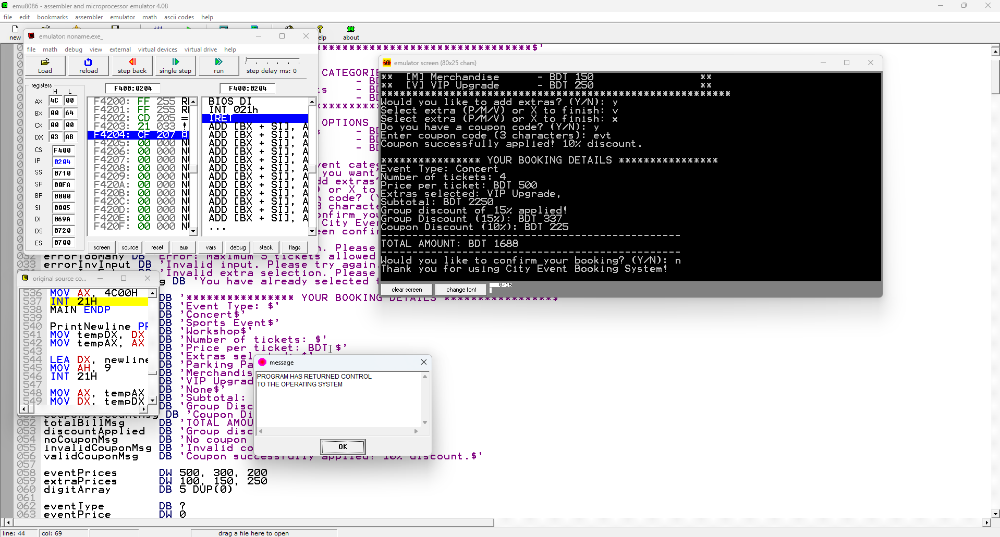

# 🎟️ Local Event Booking System

A text-based based Local Event Booking System written in **Intel 8086 Assembly**, allowing users to book tickets for concerts, sports games, and workshops. Built to simulate real-world event booking logic using low-level programming principles, this project demonstrates essential concepts such as input validation, conditional logic, price calculation, and discount application.

---

## 🚀 Features

* 👋 **Welcome Message:** Greets the user with a welcome message.
* 🎭 **Event Selection:**

  * Concert (`C`)
  * Sports (`S`)
  * Workshop (`W`)
* 🔢 **Ticket Input:** Purchase up to 5 tickets.
* ❗ **Input Validation:**

  * Error if ticket quantity exceeds 5
  * Error on invalid event code
* ➕ **Extras:** Optional add-ons:

  * Parking
  * Merchandise
  * VIP Upgrade
* 💰 **Billing Logic:**

  * Calculates cost based on event type and ticket count
  * Applies **15% group discount** for 3 or more tickets
  * Accepts **coupon codes** for additional savings
* 📋 **Final Bill Display:** Shows an itemized breakdown and total price

---

## 💡 Educational Purpose

This system simulates a real-world application while showcasing:

* Use of **registers** and **memory management**
* User **input handling** via keyboard interrupts
* **Arithmetic operations** and logic flow control
* Conditional branching and looping in **8086 Assembly**

By building this system from the ground up, we explored how simple real-world problems can be handled with low-level hardware logic.

---

## 💻 Platform

* **Language:** Assembly Language (Intel 8086)
* **Architecture:** x86
* **Recommended Emulator:** [EMU8086](https://emu8086-microprocessor-emulator.en.softonic.com/)

---

## 🛠️ How to Run

### Using EMU8086

1. Open the `.asm` file in EMU8086.
2. Compile and run using the emulator's interface.

---

## 📦 Sample Use Cases

| Scenario                         | Expected Outcome                 |
| -------------------------------- | -------------------------------- |
| 2 concert tickets + parking      | No discount, parking fee added   |
| 4 sports tickets + VIP           | 15% group discount applied       |
| 3 workshop tickets + coupon code | Group + coupon discounts applied |

---

## Screenshots

## 👥 Contributors

- **B M Rauf**
- **Siam Ferdous**
- **Md Ridwanul Basit**

---
